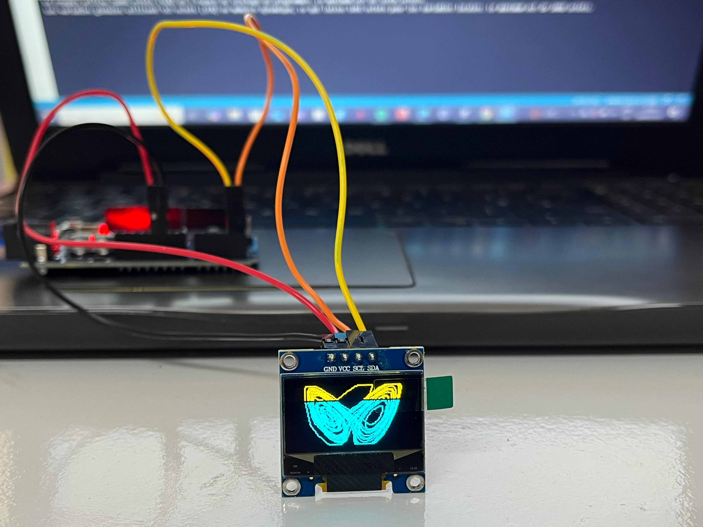

# Attracteur de Lorenz sur OLED

## Description
L’attracteur de Lorenz est un exemple célèbre en **systèmes dynamiques et chaotiques**.  
Il illustre comment de petites variations dans les conditions initiales peuvent conduire à des trajectoires très différentes, ce qu’on appelle l’effet papillon.  

## Utilité
Étudier l’attracteur de Lorenz permet de **comprendre le comportement chaotique** de certains systèmes physiques ou météorologiques.  
Dans ce projet, il sert surtout à **visualiser graphiquement le chaos sur un petit écran OLED**, ce qui rend les mathématiques abstraites beaucoup plus concrètes et visuelles.  

## Résultat concret
Le projet affiche sur un écran OLED :  
- La **courbe de l’attracteur de Lorenz** en temps réel  
- Une **animation du mouvement chaotique**, montrant comment les trajectoires évoluent et s’entrelacent

## Aperçu
 

## Matériel nécessaire
- Arduino Uno R3  
- Écran OLED SSD1306
- Câbles de connexion
- Librairies Arduino : Adafruit SSD1306, Adafruit GFX

## Code
Le fichier principal est `LorenzAttractor.ino`

### Instructions rapides
1. Ouvrir `LorenzAttractor.ino` dans Arduino IDE.  
2. Installer les librairies si besoin.  
3. Connecter l’écran OLED à l’Arduino.  
4. Cliquer sur **Upload** pour téléverser le code.  

